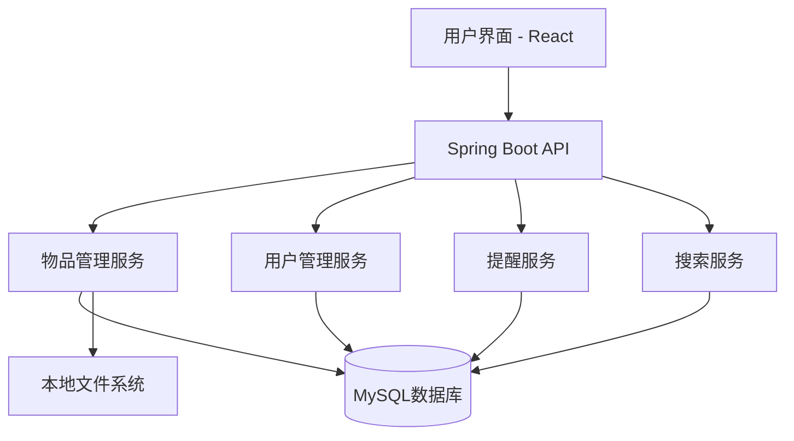
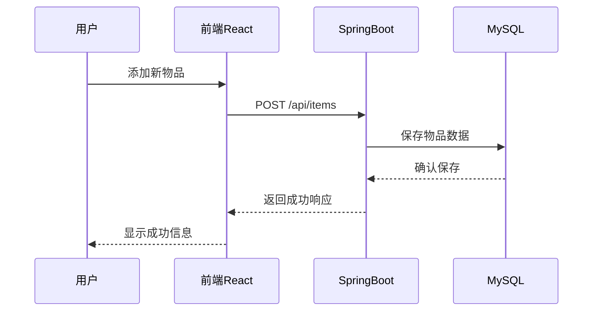

# Architecture for 家庭物品管理 Web App

Status: Approved

## Technical Summary

本系统为家庭物品管理Web App，采用前后端分离架构。前端基于React.js + TypeScript，后端采用Java + Spring Boot，数据存储使用MySQL，物品图片存储于本地文件系统。系统支持多用户、家庭组、物品管理、提醒、基础统计等功能，强调数据安全、隐私保护和良好的用户体验。后续可扩展高级搜索、数据分析、扫码、社区等功能。

## Technology Table

| 技术         | 描述                                         |
| ------------ | --------------------------------------------- |
| React.js + TS| 前端交互式界面，TypeScript提升类型安全         |
| Material-UI  | 现代化UI组件库                               |
| Redux/Toolkit| 状态管理                                     |
| Java + Spring Boot | 后端API服务器，安全、可扩展                |
| MySQL        | 关系型数据库，存储物品和用户数据              |
| JWT + Spring Security | 用户认证与授权                         |
| 本地文件系统 | 物品图片存储                                 |
| Jest         | 前端单元测试                                 |
| Spock + groovy        | 后端单元/集成测试                            |
| GitHub Actions | 持续集成与部署                              |
| Ubuntu服务器 | 本地局域网部署，无容器                       |

## Architectural Diagrams





## Data Models, API Specs, Schemas, etc...

- 物品模型：id, name, description, category, tags, location, purchaseDate, price, warrantyExpiry, images, ownerId, createdAt, updatedAt
- 用户模型：id, username, password, role, familyId, ...
- 家庭组模型：id, name, members, ...
- API接口：/api/items, /api/users, /api/families, /api/auth 等
- 详细见 .ai/database-model.md 和 .ai/api-spec.md

## Project Structure

```
src/
├── main/
│   ├── java/
│   │   ├── com/homeitem/
│   │   │   ├── config/        # 应用配置类
│   │   │   ├── controller/    # API控制器
│   │   │   ├── model/         # 数据模型实体类
│   │   │   │   └── dto/       # 数据传输对象
│   │   │   ├── repository/    # 数据访问层
│   │   │   ├── service/       # 业务逻辑服务
│   │   │   │   └── impl/      # 服务实现类
│   │   │   ├── util/          # 工具类
│   │   │   └── HomeItemApplication.java  # 应用入口
│   ├── resources/
│   │   ├── static/            # 前端静态资源
│   │   ├── templates/         # 模板文件
│   │   ├── application.properties # 应用配置
│   │   └── application-dev.properties # 开发环境配置
├── test/
│   └── java/
│       └── com/homeitem/
│           ├── controller/    # 控制器测试
│           ├── service/       # 服务测试
│           └── repository/    # 仓库测试
├── frontend/                  # 前端React项目
│   ├── public/                # 静态文件
│   ├── src/
│   │   ├── components/        # React组件
│   │   │   ├── common/        # 通用组件
│   │   │   ├── items/         # 物品相关组件
│   │   │   ├── layout/        # 布局组件
│   │   │   └── auth/          # 认证组件
│   │   ├── pages/             # 页面组件
│   │   ├── hooks/             # 自定义钩子
│   │   ├── services/          # API服务
│   │   ├── store/             # Redux状态管理
│   │   ├── utils/             # 工具函数
│   │   └── App.tsx            # 应用入口
│   ├── package.json           # 前端依赖配置
│   └── tsconfig.json          # TypeScript配置
└── pom.xml                    # Maven项目配置
```

## Infrastructure

- MySQL数据库本地部署，定期备份
- 物品图片存储于服务器本地文件系统，严格权限控制
- Spring Boot服务运行于Ubuntu服务器，局域网访问
- 前端静态资源通过Nginx或Spring Boot静态目录提供
- CI/CD采用GitHub Actions自动化测试与部署

## Security & Privacy

- 所有用户密码使用 bcrypt 加密存储
- API 统一采用 JWT 鉴权，权限细粒度控制
- 图片上传路径校验，防止目录遍历与注入
- 关键操作与异常均有日志记录，日志脱敏
- 数据库定期备份，支持一键恢复
- 前后端均有输入校验，防止XSS/SQL注入

## Testing Strategy

- 后端所有单元与集成测试均采用 Spock + groovy，Mock 依赖，覆盖率目标80%+
- 前端主要交互与组件采用 Jest + React Testing Library
- CI流程中自动运行所有测试，未通过则阻断部署

## API Documentation

- 后端接口采用 Swagger/OpenAPI 自动生成文档，前后端协作统一标准

## Extensibility & Evolution

- 当前为单体架构，未来可平滑升级为微服务或容器化部署
- 代码结构与接口设计均考虑后续功能扩展（如扫码、社区、AI识别等）

## CI/CD Details

- 采用本地部署脚本进行局域网服务器部署，不依赖GitHub Actions自动化部署
- 部署流程：
  - 代码开发完成后，开发者在本地运行测试，确保全部通过
  - 使用部署脚本将后端（Spring Boot jar）、前端（build静态文件）、配置文件等同步到服务器指定目录
  - 服务器上重启后端服务，前端静态资源由Nginx或Spring Boot静态目录提供
  - 数据库和图片目录定期手动/脚本化备份
  - 部署脚本支持一键回滚和日志记录，便于故障恢复

## Deployment Plan

1. 本地开发环境：开发者本地运行前后端，连接本地MySQL
2. 测试环境/正式环境：局域网服务器通过部署脚本同步和部署最新代码、配置和资源
3. 部署流程：
   - 本地测试通过后，运行部署脚本将后端jar、前端build、配置文件等同步到服务器
   - 服务器自动重启服务并校验运行状态
   - 备份数据库和图片目录，支持一键恢复

## Change Log

- 2024-06-10: 架构文档初稿，基于PRD v1.0.0 