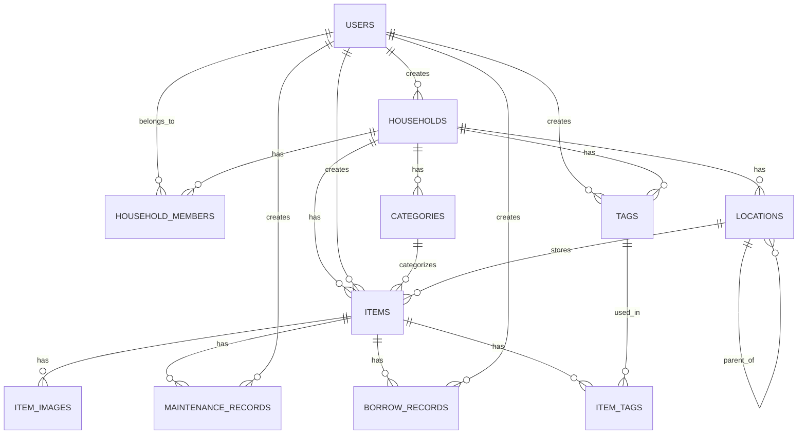

# 家庭物品管理系统 - 数据库模型设计

本文档详细描述家庭物品管理系统的数据库模型设计，包括所有表结构、关系和SQL创建语句。

## 核心表设计

### 用户表（users）
```sql
CREATE TABLE users (
    id BIGINT PRIMARY KEY AUTO_INCREMENT,
    username VARCHAR(50) NOT NULL UNIQUE,
    password VARCHAR(255) NOT NULL,
    email VARCHAR(100) NOT NULL UNIQUE,
    full_name VARCHAR(100) NOT NULL,
    role ENUM('ADMIN', 'ADVANCED_USER', 'BASIC_USER', 'GUEST') NOT NULL,
    created_at TIMESTAMP DEFAULT CURRENT_TIMESTAMP,
    updated_at TIMESTAMP DEFAULT CURRENT_TIMESTAMP ON UPDATE CURRENT_TIMESTAMP,
    last_login TIMESTAMP NULL,
    active BOOLEAN DEFAULT TRUE
);
```

### 家庭组表（households）
```sql
CREATE TABLE households (
    id BIGINT PRIMARY KEY AUTO_INCREMENT,
    name VARCHAR(100) NOT NULL,
    description TEXT,
    created_by BIGINT NOT NULL,
    created_at TIMESTAMP DEFAULT CURRENT_TIMESTAMP,
    updated_at TIMESTAMP DEFAULT CURRENT_TIMESTAMP ON UPDATE CURRENT_TIMESTAMP,
    FOREIGN KEY (created_by) REFERENCES users(id)
);
```

### 家庭成员表（household_members）
```sql
CREATE TABLE household_members (
    household_id BIGINT NOT NULL,
    user_id BIGINT NOT NULL,
    role ENUM('ADMIN', 'ADVANCED_USER', 'BASIC_USER', 'GUEST') NOT NULL,
    joined_at TIMESTAMP DEFAULT CURRENT_TIMESTAMP,
    PRIMARY KEY (household_id, user_id),
    FOREIGN KEY (household_id) REFERENCES households(id),
    FOREIGN KEY (user_id) REFERENCES users(id)
);
```

## 物品相关表

### 物品分类表（categories）
```sql
CREATE TABLE categories (
    id BIGINT PRIMARY KEY AUTO_INCREMENT,
    name VARCHAR(50) NOT NULL,
    description TEXT,
    household_id BIGINT NOT NULL,
    created_by BIGINT NOT NULL,
    created_at TIMESTAMP DEFAULT CURRENT_TIMESTAMP,
    FOREIGN KEY (household_id) REFERENCES households(id),
    FOREIGN KEY (created_by) REFERENCES users(id)
);
```

### 位置表（locations）
```sql
CREATE TABLE locations (
    id BIGINT PRIMARY KEY AUTO_INCREMENT,
    name VARCHAR(100) NOT NULL,
    description TEXT,
    parent_location_id BIGINT NULL,
    household_id BIGINT NOT NULL,
    created_by BIGINT NOT NULL,
    created_at TIMESTAMP DEFAULT CURRENT_TIMESTAMP,
    updated_at TIMESTAMP DEFAULT CURRENT_TIMESTAMP ON UPDATE CURRENT_TIMESTAMP,
    FOREIGN KEY (parent_location_id) REFERENCES locations(id),
    FOREIGN KEY (household_id) REFERENCES households(id),
    FOREIGN KEY (created_by) REFERENCES users(id)
);
```

### 物品表（items）
```sql
CREATE TABLE items (
    id BIGINT PRIMARY KEY AUTO_INCREMENT,
    name VARCHAR(255) NOT NULL,
    description TEXT,
    category_id BIGINT NULL,
    location_id BIGINT NULL,
    status ENUM('NEW', 'USED', 'DAMAGED', 'DISCARDED') DEFAULT 'NEW',
    purchase_date DATE NULL,
    purchase_price DECIMAL(10,2) NULL,
    purchase_store VARCHAR(100) NULL,
    warranty_period INT NULL,
    warranty_expiry_date DATE NULL,
    household_id BIGINT NOT NULL,
    created_by BIGINT NOT NULL,
    created_at TIMESTAMP DEFAULT CURRENT_TIMESTAMP,
    updated_at TIMESTAMP DEFAULT CURRENT_TIMESTAMP ON UPDATE CURRENT_TIMESTAMP,
    FOREIGN KEY (category_id) REFERENCES categories(id),
    FOREIGN KEY (location_id) REFERENCES locations(id),
    FOREIGN KEY (household_id) REFERENCES households(id),
    FOREIGN KEY (created_by) REFERENCES users(id)
);
```

### 物品标签表（tags）
```sql
CREATE TABLE tags (
    id BIGINT PRIMARY KEY AUTO_INCREMENT,
    name VARCHAR(50) NOT NULL,
    household_id BIGINT NOT NULL,
    created_by BIGINT NOT NULL,
    created_at TIMESTAMP DEFAULT CURRENT_TIMESTAMP,
    FOREIGN KEY (household_id) REFERENCES households(id),
    FOREIGN KEY (created_by) REFERENCES users(id)
);
```

### 物品-标签关联表（item_tags）
```sql
CREATE TABLE item_tags (
    item_id BIGINT NOT NULL,
    tag_id BIGINT NOT NULL,
    PRIMARY KEY (item_id, tag_id),
    FOREIGN KEY (item_id) REFERENCES items(id),
    FOREIGN KEY (tag_id) REFERENCES tags(id)
);
```

## 附加功能表

### 物品图片表（item_images）
```sql
CREATE TABLE item_images (
    id BIGINT PRIMARY KEY AUTO_INCREMENT,
    item_id BIGINT NOT NULL,
    file_path VARCHAR(255) NOT NULL,
    file_name VARCHAR(255) NOT NULL,
    file_size BIGINT NOT NULL,
    content_type VARCHAR(100) NOT NULL,
    is_primary BOOLEAN DEFAULT FALSE,
    upload_date TIMESTAMP DEFAULT CURRENT_TIMESTAMP,
    FOREIGN KEY (item_id) REFERENCES items(id)
);
```

### 维护记录表（maintenance_records）
```sql
CREATE TABLE maintenance_records (
    id BIGINT PRIMARY KEY AUTO_INCREMENT,
    item_id BIGINT NOT NULL,
    description TEXT NOT NULL,
    maintenance_date DATE NOT NULL,
    cost DECIMAL(10,2) NULL,
    created_by BIGINT NOT NULL,
    created_at TIMESTAMP DEFAULT CURRENT_TIMESTAMP,
    FOREIGN KEY (item_id) REFERENCES items(id),
    FOREIGN KEY (created_by) REFERENCES users(id)
);
```

### 借出记录表（borrow_records）
```sql
CREATE TABLE borrow_records (
    id BIGINT PRIMARY KEY AUTO_INCREMENT,
    item_id BIGINT NOT NULL,
    borrowed_by VARCHAR(100) NOT NULL,
    borrow_date DATE NOT NULL,
    expected_return_date DATE NULL,
    actual_return_date DATE NULL,
    status ENUM('BORROWED', 'RETURNED', 'OVERDUE') DEFAULT 'BORROWED',
    notes TEXT,
    created_by BIGINT NOT NULL,
    created_at TIMESTAMP DEFAULT CURRENT_TIMESTAMP,
    updated_at TIMESTAMP DEFAULT CURRENT_TIMESTAMP ON UPDATE CURRENT_TIMESTAMP,
    FOREIGN KEY (item_id) REFERENCES items(id),
    FOREIGN KEY (created_by) REFERENCES users(id)
);
```

## 数据库关系图



## 索引设计

为提高查询性能，系统将创建以下索引：

1. 物品表上的位置索引和分类索引
2. 物品表上的household_id索引
3. 位置表上的parent_location_id索引
4. 借出记录表上的status索引
5. 物品图片表上的item_id索引
6. 维护记录表上的maintenance_date索引
7. 物品表上的warranty_expiry_date索引（用于提醒功能）

## 数据迁移与版本管理

系统将使用Flyway进行数据库迁移管理，确保数据库结构可被版本控制并在不同环境中一致部署。所有数据库更改都将通过版本化的迁移脚本实现。 