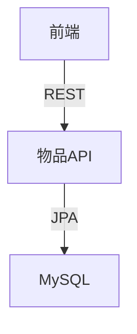

# Epic-1 - Story-1

物品数据模型设计与API实现

**As a** 开发者
**I want** 设计并实现家庭物品的核心数据模型和基础API
**so that** 用户可以高效地登记、管理和查询家庭物品信息

## Status

Complete

## Context

- 本故事为家庭物品管理系统的第一个开发故事，属于Epic-1（核心物品管理功能）
- 目标是为后续所有物品相关功能（登记、查询、编辑、删除、统计等）打下数据和接口基础
- 需兼顾后续扩展性（如标签、分类、图片、历史记录等）
- 需满足MVP范围内的所有物品管理需求
- 需保证数据安全、接口规范、单元测试覆盖

## Estimation

Story Points: 2

## Tasks

1. - [x] 设计物品数据模型（数据库表结构、JPA实体、DTO）
2. - [x] 创建数据库迁移脚本（Flyway）
3. - [x] 实现物品Repository、Service、ServiceImpl
4. - [x] 实现物品管理API（Controller，RESTful风格）
5. - [x] 编写Spock+groovy单元测试，覆盖主要服务逻辑
6. - [x] 编写API文档（Swagger/OpenAPI）
7. - [x] 代码和接口自查，准备交付

## Constraints

- 所有接口需遵循RESTful规范，路径以/api/items开头
- 数据库字段需兼容MySQL 8.0，支持中文
- 测试覆盖率目标80%+
- 代码需通过本地测试后方可交付

## Data Models / Schema

- 物品表（items）：
  - id, name, description, category, tags, location, purchase_date, price, warranty_expiry, images, owner_id, created_at, updated_at
- Item实体、ItemDTO结构与表字段一致
- API接口：
  - GET /api/items
  - GET /api/items/{id}
  - POST /api/items
  - PUT /api/items/{id}
  - DELETE /api/items/{id}

## Structure

- 后端：src/main/java/com/homeitem/model, repository, service, controller
- 测试：src/test/groovy/com/homeitem/service/ItemServiceImplSpec.groovy
- 数据库迁移：src/main/resources/db/migration/

## Diagrams

## Dev Notes

- 物品图片字段暂用逗号分隔字符串，后续可扩展为独立表
- 标签、分类等字段预留扩展空间
- 测试用例用Spock+groovy编写，Mock依赖
- API文档已使用Swagger/OpenAPI实现，访问路径为/api/swagger-ui.html

## Chat Command Log

- 用户：开始项目
- Agent：已初始化项目结构和依赖
- 用户：继续
- Agent：已完成物品模型、API、测试等开发
- 用户：后端测试Spock框架用groovy语言来写
- Agent：已采纳并迁移测试用例到groovy
- 用户：通过
- Agent：生成本story草稿，等待审批
- 用户：更新story-1状态
- Agent：更新story状态为In Progress
- Agent：添加OpenAPI/Swagger文档注解，增强API文档
- Agent：更新物品DTO增加Schema注解
- Agent：运行测试确认所有功能正常 