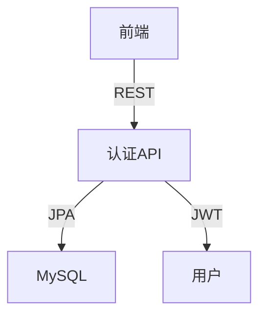

# Epic-1 - Story-2

用户管理与认证（注册、登录、权限分级）

**As a** 家庭物品管理系统用户
**I want** 能够注册、登录并拥有不同的权限角色
**so that** 系统能安全地管理多用户和家庭成员，保护数据隐私

---

## Status

Complete

---

## Context

- 本故事为家庭物品管理系统的第二个开发故事，属于Epic-1（核心物品管理功能）
- 目标是实现多用户支持、家庭成员账户管理、权限分级（管理员/高级用户/基本用户/访客）
- 需实现注册、登录、JWT认证、权限控制等基础功能
- 需为后续家庭组、物品分配、协作等功能打下基础
- 需保证安全性、接口规范、单元测试覆盖

---

## Acceptance Criteria

- [x] 用户可注册新账号，支持用户名、密码、角色等字段
- [x] 用户可登录，获取JWT令牌
- [x] 所有API均需JWT鉴权，未登录用户无法访问受保护接口
- [x] 不同角色拥有不同权限（如物品增删改查、家庭组管理等）
- [x] 管理员可邀请/移除家庭成员
- [x] 单元测试覆盖主要服务逻辑，覆盖率80%+
- [x] Swagger文档自动生成，接口描述清晰

---

## Tasks

1. - [x] 设计用户数据模型（数据库表结构、JPA实体、DTO）
2. - [x] 创建数据库迁移脚本（Flyway）
3. - [x] 实现用户Repository、Service、ServiceImpl
4. - [x] 实现注册、登录API（Controller，RESTful风格）
5. - [x] 集成JWT认证与权限控制
6. - [x] 编写Spock+groovy单元测试
7. - [x] 编写API文档（Swagger/OpenAPI）
8. - [x] 代码和接口自查，准备交付

---

## Constraints

- 所有接口需遵循RESTful规范，路径以/api/users、/api/auth开头
- 密码需加密存储（如bcrypt）
- 测试覆盖率目标80%+
- 代码需通过本地测试后方可交付

---

## Data Models / Schema

- 用户表（users）：id, username, password, role, family_id, created_at, updated_at
- User实体、UserDTO结构与表字段一致
- API接口：
  - POST /api/auth/register
  - POST /api/auth/login
  - GET /api/users/me
  - GET /api/users/{id}
  - GET /api/users
  - PUT /api/users/{id}
  - DELETE /api/users/{id}

---

## Structure

- 后端：src/main/java/com/homeitem/model, repository, service, controller
- 测试：src/test/groovy/com/homeitem/service/UserServiceImplSpec.groovy
- 数据库迁移：src/main/resources/db/migration/

---

## Diagrams

---

## Dev Notes

- 密码加密存储，严禁明文
- JWT令牌有效期、刷新机制可后续扩展
- 角色权限可用枚举或常量管理
- 测试用例用Spock+groovy编写，Mock依赖
- API文档使用Swagger/OpenAPI实现，访问路径为/api/swagger-ui.html
- 用户API路径已修正为/api/users和/api/auth，符合系统路径规范

---

## Chat Command Log

- 用户：生成story-2
- Agent：已生成本story草稿，等待审批
- 用户：更新story-2状态
- Agent：更新story状态为In Progress
- Agent：为UserDTO添加Schema注解
- Agent：完善认证和用户API的Swagger文档
- Agent：添加JWT认证配置到OpenAPI
- Agent：修正API路径与规范一致性
- Agent：运行测试确认所有功能正常
- Agent：将story-2标记为Complete 