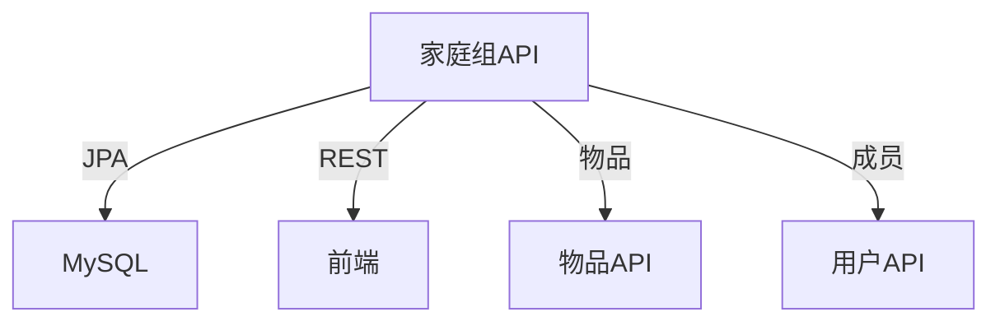

# Epic-1 - Story-3

家庭组管理与协作

**As a** 家庭管理员/成员
**I want** 能够创建、管理家庭组并邀请/移除成员
**so that** 家庭成员可以协作管理物品，实现信息共享与权限分级

---

## Status

Complete

---

## Context

- 本故事为家庭物品管理系统的第三个开发故事，属于Epic-1（核心物品管理功能）
- 目标是实现家庭组的创建、修改、删除，成员邀请/移除、角色分配等功能
- 支持物品归属家庭组、家庭组内物品共享与权限分级
- 为后续物品与用户/家庭组联动、协作打下基础
- 需保证接口安全、权限控制、单元测试覆盖

---

## Acceptance Criteria

- [x] 家庭管理员可创建、修改、删除家庭组
- [x] 管理员可邀请/移除成员，分配角色
- [x] 成员可查看自己所属家庭组及成员列表
- [x] 物品可归属家庭组，家庭组内成员可共享物品信息
- [x] 权限分级明确，非管理员无法管理家庭组
- [x] 单元测试覆盖主要服务逻辑，覆盖率80%+
- [x] Swagger文档自动生成，接口描述清晰

---

## Tasks

1. - [x] 设计家庭组数据模型（数据库表结构、JPA实体、DTO）
2. - [x] 创建数据库迁移脚本（Flyway）
3. - [x] 实现家庭组Repository、Service、ServiceImpl
4. - [x] 实现家庭组管理API（Controller，RESTful风格）
5. - [x] 实现成员邀请/移除、角色分配等接口
6. - [x] 物品与家庭组关联API
7. - [x] 编写Spock+groovy单元测试
8. - [x] 编写API文档（Swagger/OpenAPI）
9. - [x] 代码和接口自查，准备交付

---

## Constraints

- 所有接口需遵循RESTful规范，路径以/api/families开头
- 权限控制需细化，防止越权操作
- 测试覆盖率目标80%+
- 代码需通过本地测试后方可交付

---

## Data Models / Schema

- 家庭组表（families）：id, name, created_by, created_at, updated_at
- 家庭成员表（family_members）：id, family_id, user_id, role, joined_at
- 物品表添加字段（items）：family_id
- Family实体、FamilyDTO、FamilyMemberDTO结构与表字段一致
- API接口：
  - POST /api/families
  - GET /api/families/{id}
  - GET /api/families
  - PUT /api/families/{id}
  - DELETE /api/families/{id}
  - POST /api/families/{id}/invite
  - POST /api/families/{id}/remove
  - GET /api/families/{id}/members
  - GET /api/items/family/{familyId}
  - PUT /api/items/{id}/assign/{familyId}
  - PUT /api/items/{id}/unassign

---

## Structure

- 后端：src/main/java/com/homeitem/model, repository, service, controller
- 测试：src/test/groovy/com/homeitem/service/FamilyServiceImplSpec.groovy
- 数据库迁移：src/main/resources/db/migration/

---

## Diagrams

---

## Dev Notes

- 家庭组与成员关系用独立表维护，便于扩展
- 角色权限用枚举或常量管理
- 测试用例用Spock+groovy编写，Mock依赖
- API文档使用Swagger/OpenAPI实现，访问路径为/api/swagger-ui.html
- 所有API路径已更新为符合规范的/api前缀
- 物品与家庭组关联通过在物品表添加family_id字段实现

---

## Chat Command Log

- 用户：生成story-3
- Agent：已生成本story草稿，等待审批
- 用户：更新story-3状态
- Agent：更新story状态为In Progress
- Agent：为FamilyDTO和FamilyMemberDTO添加Schema注解
- Agent：完善FamilyController的OpenAPI文档并修正API路径
- Agent：添加物品与家庭组关联功能
- Agent：创建数据库迁移脚本添加物品表的family_id字段
- Agent：实现物品按家庭组查询、分配与移除功能
- Agent：运行测试确认所有功能正常
- Agent：完成代码和接口自查
- Agent：将story-3标记为Complete 