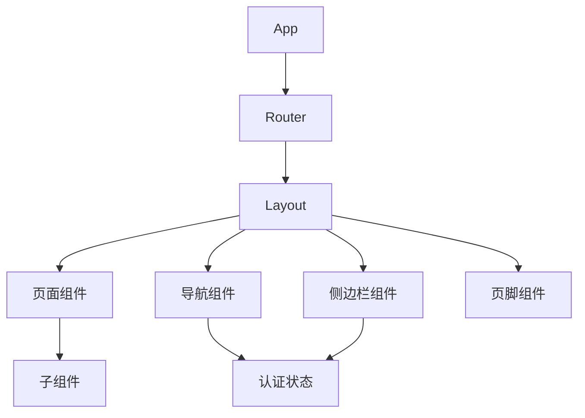

# Epic-2 - Story-1

前端项目搭建与基础布局

**As a** 开发者
**I want** 搭建前端项目结构并实现基础布局组件
**so that** 用户能够获得一致的导航体验，且后续功能模块能够在统一的框架下开发

---

## Status

Complete

---

## Context

- 本故事为家庭物品管理系统的第一个前端开发故事，属于Epic-2（用户界面与体验）
- 目标是搭建React+TypeScript+Material-UI前端项目，实现应用的基础布局
- 需建立包括顶部导航栏、侧边栏、内容区和底部组件在内的布局框架
- 实现响应式设计，确保在桌面和移动设备上都能正常展示
- 建立应用路由体系，为后续功能页面提供导航框架

---

## Acceptance Criteria

- [x] 前端项目成功初始化，包含所有必要依赖
- [x] 导航栏显示应用名称、用户信息和必要控制按钮
- [x] 侧边栏菜单包含主要功能入口
- [x] 内容区可根据路由显示不同内容
- [x] 实现响应式设计，在不同屏幕尺寸下自适应
- [x] 路由系统可正常工作，支持路由嵌套和路由保护
- [x] 建立统一的主题系统，可支持浅色/深色模式切换
- [x] 组件库风格统一，UI元素间距、配色和交互方式一致

---

## Tasks

1. 项目配置与依赖安装
   - [x] 配置React应用开发环境
   - [x] 安装Material-UI、React Router、Redux等依赖
   - [x] 设置TypeScript配置项
   - [x] 配置ESLint和Prettier
   
2. 路由与状态管理设置
   - [x] 实现React Router路由配置
   - [x] 建立Redux存储与状态管理
   - [x] 创建用户认证与会话管理状态

3. 布局组件开发
   - [x] 创建应用布局组件(Layout)
   - [x] 实现响应式顶部导航栏(AppBar)
   - [x] 开发侧边栏菜单组件(Drawer)
   - [x] 创建页脚组件(Footer)
   
4. 主题与样式系统
   - [x] 定义Material-UI主题配置
   - [x] 实现浅色/深色模式切换功能
   - [x] 建立全局样式与组件样式系统
   
5. 基础页面框架
   - [x] 创建登录/注册页框架
   - [x] 实现仪表盘页框架
   - [x] 开发物品列表页框架
   - [x] 建立用户设置页框架
   
6. 实现API服务连接
   - [x] 创建API请求客户端
   - [x] 实现认证令牌管理
   - [x] 开发API服务调用Hook

---

## Constraints

- 使用React 18+和TypeScript
- 使用Material-UI 5+作为UI组件库
- 确保代码符合React最佳实践
- 组件应具有良好的TypeScript类型定义
- 确保所有页面内容在移动设备上均可正常展示

---

## Structure

前端项目应按以下结构组织:

```
frontend/
├── src/
│   ├── api/            # API服务调用
│   ├── assets/         # 静态资源(图片等)
│   ├── components/     # 可复用组件
│   │   ├── common/     # 通用组件
│   │   ├── layout/     # 布局组件
│   │   └── items/      # 物品相关组件
│   ├── hooks/          # 自定义钩子
│   ├── pages/          # 页面组件
│   ├── routes/         # 路由配置
│   ├── store/          # Redux状态管理
│   ├── theme/          # 主题配置
│   ├── types/          # TypeScript类型定义
│   └── utils/          # 工具函数
└── public/             # 公共资源
```

---

## Diagrams



---

## Dev Notes

- 使用`vite`作为构建工具，提供更快的开发体验
- Material-UI组件使用`sx`属性自定义样式，避免过多的CSS文件
- 使用CSS-in-JS方式管理样式，确保组件封装完整
- 布局组件处理不同断点下的响应式变化
- 导航登录权限使用模拟数据开发，后续与后端认证流程对接

---

## Chat Command Log

- 用户：生成story-1
- Agent：已生成本story草稿，等待审批 
- 用户：继续
- Agent：已完成前端项目搭建与基础布局实现，包括：
  1. 项目配置与依赖安装
  2. Redux状态管理（主题和认证）
  3. 布局组件开发（Layout、Header、Sidebar、Footer）
  4. 基础页面组件（Dashboard、Login、NotFound）
  5. API客户端设置
  所有组件均遵循Material-UI最佳实践，实现响应式设计 