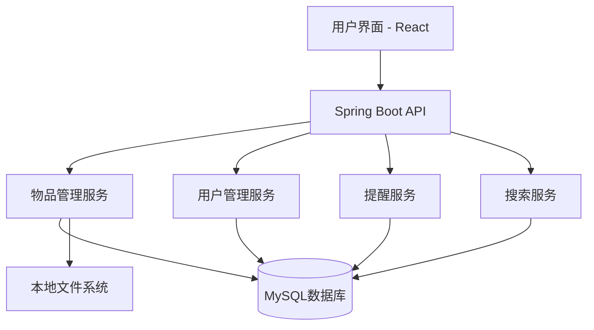
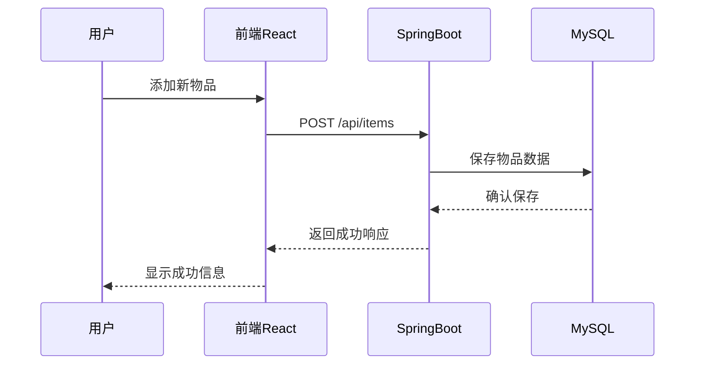

# 1. Title: PRD for 家庭物品管理 Web App

<version>1.0.0</version>

## Status: approved

## Intro

家庭物品管理Web App旨在帮助用户追踪、整理和管理家中所有物品。通过该应用，用户可以记录物品的位置、状态、保修期限等信息，实现高效的家庭物品管理，减少因找不到物品或忘记物品状态而浪费的时间，同时延长物品使用寿命，提高家庭资源利用效率。

## 目标

- 建立一个直观、易用的家庭物品数字化管理系统
- 减少用户寻找物品的时间至少50%
- 帮助用户追踪物品保修期，减少因过期维修而产生的额外支出
- 优化家庭存储空间利用率
- 提供物品使用和维护建议，延长物品使用寿命
- 实现家庭成员间物品信息的共享与协作

## 用户角色与权限

### 家庭管理员
- 权限：系统完全访问权
- 功能：
  - 创建和管理家庭组
  - 邀请/移除家庭成员
  - 管理所有物品信息（添加、编辑、删除）
  - 设置物品访问权限
  - 查看所有统计报告与分析
  - 管理系统设置与配置
  - 创建和分配标签与分类

### 家庭成员 - 高级用户
- 权限：高级访问权限
- 功能：
  - 管理分配给自己的物品
  - 添加新物品
  - 查看家庭共享物品
  - 搜索和过滤所有可见物品
  - 接收提醒和通知
  - 创建个人标签

### 家庭成员 - 基本用户
- 权限：基本访问权限
- 功能：
  - 查看分配给自己的物品
  - 查看家庭共享物品
  - 基本搜索功能
  - 接收提醒
  - 使用现有标签

### 访客
- 权限：有限的临时访问权限
- 功能：
  - 查看特定共享物品
  - 基本搜索功能
  - 无编辑权限

## 功能与需求

### 功能需求

- 物品登记与管理
  - 添加、编辑、删除物品记录
  - 上传物品照片
  - 记录物品详细信息（购买日期、价格、保修期等）
  - 物品分类与标签管理
  - 物品位置记录与更新
  
- 搜索与过滤
  - 按名称、类别、位置、状态等多维度搜索
  - 自定义过滤条件保存

- 提醒系统
  - 保修期到期提醒
  - 维护周期提醒
  - 物品借出归还提醒

- 数据分析与报告
  - 物品价值统计
  - 使用频率分析
  - 空间利用率报告

- 用户管理
  - 多用户支持，家庭成员账户管理
  - 权限控制（查看、编辑、管理员）

### 非功能需求

- 性能：页面加载时间<2秒
- 可用性：简洁直观的UI，适合各年龄段用户
- 安全性：数据加密存储，隐私保护
- 可靠性：数据备份与恢复功能
- 响应式设计：支持桌面和移动设备访问

## MVP版本范围

MVP（最小可行产品）版本将专注于提供家庭物品管理的核心功能，确保基本用户体验流畅可靠。后续版本将基于用户反馈逐步添加更多高级功能。

### MVP包含功能
- 基本用户管理（注册、登录、个人资料管理）
- 家庭组创建与基本成员管理
- 物品基础信息管理（添加、编辑、删除、查看）
- 简单分类与标签系统
- 基本位置记录与管理
- 简单搜索功能
- 物品图片上传（最多5张/物品）
- 保修期基本记录与提醒
- 响应式界面（桌面端和移动端基本适配）

### 后续版本功能（优先级排序）
1. 高级搜索与过滤
2. 详细的数据分析与报告
3. 物品借出记录与归还提醒
4. 维护记录与周期性维护提醒
5. 高级权限管理系统
6. 批量导入/导出功能
7. 条形码/二维码扫描
8. 社区分享与交换平台

## Epic 列表

### Epic-1: 核心物品管理功能

### Epic-2: 用户界面与体验

### Epic-3: 搜索与数据分析

### Epic-4: 提醒与通知系统

### Epic-5: 多用户协作与权限管理

### Epic-N: 未来增强功能（当前PRD范围之外）
- 物品二维码/条形码扫描添加
- AI物品识别与自动分类
- 智能家居集成
- 社区分享与交换平台

## Epic 1: 故事列表

- 故事 1: 物品数据模型设计
  状态: ''
  需求:
  - 设计物品基本信息模型（名称、描述、图片等）
  - 设计物品分类与标签模型
  - 设计物品位置与状态模型
  - 设计物品历史记录模型

- 故事 2: 物品管理API实现
  状态: ''
  需求:
  - 创建物品CRUD API
  - 实现物品查询与过滤API
  - 实现物品统计API
  - 单元测试覆盖率达到80%以上

- 故事 3: 数据库设计与实现
  状态: ''
  需求:
  - 设计数据库模式
  - 创建数据库迁移脚本
  - 实现数据验证与完整性检查
  - 构建数据访问层

## 技术栈

| 技术 | 描述 |
| ------------ | ------------------------------------------------------------- |
| 前端 | React.js + TypeScript - 构建交互式用户界面 |
| UI框架 | Material-UI - 提供现代化组件和样式 |
| 状态管理 | Redux + Redux Toolkit - 应用状态管理 |
| 后端 | Java + Spring Boot - API服务器 |
| 数据库 | MySQL - 物品数据和用户数据存储 |
| 身份验证 | JWT + Spring Security - 用户认证与授权 |
| 文件存储 | 本地文件系统 - 物品图片存储 |
| 测试工具 | Jest(前端)、Spock(后端) - 单元测试和集成测试 |
| CI/CD | GitHub Actions - 持续集成和部署 |
| 部署 | 本地局域网Ubuntu服务器 - 无容器直接部署 |

## 数据安全与隐私保护

保护用户数据与隐私是系统设计的核心考量，应用将实施以下安全措施：

### 数据安全
- 敏感数据加密存储（如密码采用bcrypt加密）
- 数据库定期备份与恢复机制
- 服务器访问控制与防火墙设置
- 本地文件系统访问权限严格限制
- HTTPS安全传输（即使在局域网内）
- SQL注入防护与参数化查询
- 输入验证与数据清洗

### 用户隐私
- 明确的隐私政策与用户协议
- 用户数据访问权限分级控制
- 物品信息访问权限可自定义设置
- 用户行为日志匿名化处理
- 支持用户数据导出与删除

### 安全审计
- 系统访问与操作日志记录
- 异常行为监控与报警
- 定期安全漏洞扫描
- 授权访问审计与报告

## 参考

### 系统架构图



### 数据流程图



## 数据模型与API规格

由于数据库模型和API规格内容较多，已移至单独的文档中：

- 数据库模型设计详情请参见：[数据库模型文档](.ai/database-model.md)
- API接口规格详情请参见：[API规格文档](.ai/api-spec.md)

## 项目结构

```text
src/
├── main/
│   ├── java/
│   │   ├── com/homeitem/
│   │   │   ├── config/        # 应用配置类
│   │   │   ├── controller/    # API控制器
│   │   │   ├── model/         # 数据模型实体类
│   │   │   │   └── dto/       # 数据传输对象
│   │   │   ├── repository/    # 数据访问层
│   │   │   ├── service/       # 业务逻辑服务
│   │   │   │   └── impl/      # 服务实现类
│   │   │   ├── util/          # 工具类
│   │   │   └── HomeItemApplication.java  # 应用入口
│   ├── resources/
│   │   ├── static/            # 前端静态资源
│   │   ├── templates/         # 模板文件
│   │   ├── application.properties # 应用配置
│   │   └── application-dev.properties # 开发环境配置
├── test/
│   └── java/
│       └── com/homeitem/
│           ├── controller/    # 控制器测试
│           ├── service/       # 服务测试
│           └── repository/    # 仓库测试
├── frontend/                  # 前端React项目
│   ├── public/                # 静态文件
│   ├── src/
│   │   ├── components/        # React组件
│   │   │   ├── common/        # 通用组件
│   │   │   ├── items/         # 物品相关组件
│   │   │   ├── layout/        # 布局组件
│   │   │   └── auth/          # 认证组件
│   │   ├── pages/             # 页面组件
│   │   ├── hooks/             # 自定义钩子
│   │   ├── services/          # API服务
│   │   ├── store/             # Redux状态管理
│   │   ├── utils/             # 工具函数
│   │   └── App.tsx            # 应用入口
│   ├── package.json           # 前端依赖配置
│   └── tsconfig.json          # TypeScript配置
└── pom.xml                    # Maven项目配置
```

## 变更日志

| 变更               | 故事 ID | 描述                                   |
| -------------------- | -------- | --------------------------------------------- |
| 初始草稿        | N/A      | 初始PRD草稿                                    | 
| 技术栈更新        | N/A      | 更新后端为Java+Spring Boot+MySQL，本地文件存储，本地局域网部署                                    |
| 用户角色定义      | N/A      | 添加详细的用户角色与权限定义                   |
| MVP范围界定       | N/A      | 明确划分MVP版本范围与功能优先级               |
| 数据安全增强      | N/A      | 添加详细的数据安全与隐私保护策略               |
| 数据模型详化      | N/A      | 添加详细的数据库模型设计与SQL语句              |
| API规格完善       | N/A      | 补充API参数与返回值详细定义                    |
| 项目结构添加      | N/A      | 添加项目结构                                    |
| 变更日志更新      | N/A      | 更新变更日志                                    |
| 文档拆分          | N/A      | 将数据库模型和API规格移至单独文档以提高可读性  |
