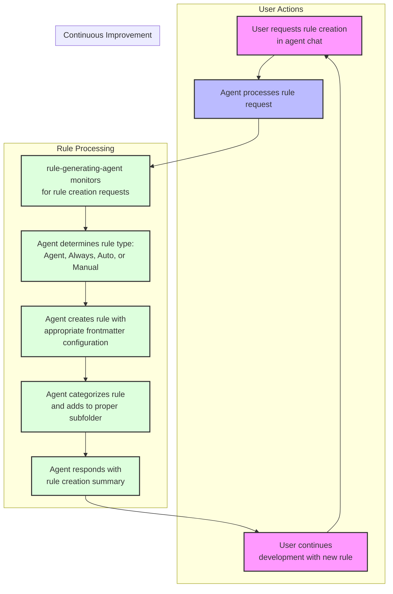

# BMad's Best Practices Cursor Custom Agents and Rules Generator

BMad Version: 3.0 (March 30, 2025)
Cursor Version: 0.48+

The name of the repo has changed to BMad Cursor Master Workflow Agent and Rules - this is still the ever evolving same project regarding rules best practices, but its evolving and expanding in features and capability as cursor evolves, becoming more and more powerful to meet the needs of the Cursor and AI Development community, as this will expand beyond cursor.

## Massive Upgrade - Please read for the BEST cursor experience to date - this will change everything - March 31, 2025

### Big fix for Agent AutoSelect Rules

Thank you to feedback from the community around this repo and in the cursor forums - an idea sparked about the description field that has been verified to be an amazing boost to agent auto selection of rules, becoming almost nearly not flaky - longer descriptions that really clearly tell it what types of scenarios or context it applies to - this was in the last version of this repo hidden away in more detail in the context that was broken by recent cursor optimization improvements to only consider the description for rule section! The rule-generating-agent has been updated to support this, integrating what was the context into the description field basically, further optimizing it to where the agent would have to be really dumb to not select it in the right scenario, or much easier to correct it!

All example rules in the repo have been updated - and a new agent select typescript rule example has also been added, that I have tested and have confirmed loads reliably.

### Game Changer Custom Agent Generation Tools and Rule - the future of workflows is multi tab custom agents!

New in the repo - example modes.json file to define your custom agents along with a template and rule to help you create these. The repo no includes in xnotes a custom-agents.md file, an example of what could be used in a prompt to cursor to then use the rule and template to generate the modes.json! While not officially used by cursor - the file will be similar to what they will release soon, but in the meantime can help you create the cursors by giving you the options to enter into the gui to create the custom agents (ensure you enable this current beta feature in the cursor settings). As soon as the version comes out to support it in cursor, this will be updated so that the rule can add to or update the new format once I have the new version that supports in in the coming weeks. But for now this is the best option, and much better than trying to manually type into the gui's tiny window for custom agent instructions. Check out .cursor/modes.json for the custom agents I am using (and still constantly tweaking).

In the future I will start to have less rules - for example I am not using the manual workflow anymore as instead I talk to the proper agent in a tab that basically has the workflow built into their instruction set.

### New Video Coming Soon!

By popular request - I will have a video up within the week showing the exact way to leverage the power of agile roles and ways of working to enhance your coding with AI Agents, wether vibe coding or deep in the weeds of brownfield, these new cursor features combined with this approach is a real gamechanger to past flakiness and random forgetfulness of the agents.

## Important Note V 0.47+

- I have updated the repo to properly add .cursor/rules/\* to the .cursorindexingignore - without this, you will run into a lot of flakiness when trying to edit or tweak an existing rule or change its type without reindexing the whole project. This will make A BIG difference.

## Important Updates TL;DR (March 25, 2025)

- Subfolder organization replaces numbered file prefixing and is fully supported by auto generation
- Agent mode recommended for rule generation
- Four distinct rule types available - see [Rule Types](#rule-types) section
- Workflow is no longer in XNotes - it has moved to .cursor/rules/workflows and /templates - this is much better and replaces the need for using the beta notepads feature, now using the manual rule macro feature instead!

> 💡 **IDE Setting HIGHLY Suggested:** For best results with rule generation, update your Cursor settings by adding:
>
> ```json
> "workbench.editorAssociations": {
>   "*.mdc": "default"
> }
> ```
>
> This prevents UI rendering issues with .mdc files and ensures proper save functionality.

## Files Excluded from Indexing

The `.cursorindexingignore` feature allows certain files to be accessible but excluded from indexing:

- Templates moved to `.cursor/templates` folder
- Included in `.cursorindexingignore` but not in `.cursorignore`
- XNotes remains in `.cursorignore` (files that need to move elsewhere to be used)

[Video Demo and Walkthrough](https://youtu.be/jEhvwYkI-og) - Subscribe for more Cursor tutorials!

> 💡 **Compatibility:** Tested with Claude Sonnet 3.5, 3.7, 3.7 Thinking, o3-mini, and GPT-4o.
> [Agile Workflow Documentation](docs/agile-readme.md)

## Overview

This template dramatically improves AI workflows in Agent/Ask/Custom Agent mode by providing:

1. **Automated Rule Generation:** Create and update rules through natural language requests
2. **Automated Custom Agent Generation:** Create and update new custom agents by describing it to the AI, who will then add or update entires in .cursor/modes.json
3. **Consistent AI Behavior:** Rules are applied automatically when appropriate or on demand or always depending on which of the 4 rule types are created/exist
4. **Quick Project Setup:** A script that will set up a new project with core rules and workflow, or add the rule generator to an existing project in a non destructive manner to existing cursor rules

> 💡 **Note:** For a complete guide to the Agile-Cursor Workflow system, see [Agile Workflow Documentation](docs/agile-readme.md).

## Key Concepts

- Rules use frontmatter with proper YAML format (description, globs, alwaysApply)
- Rules will be generated with explicitly requesting a rule be create, or implied by asking for corrective behavior from the agent
- Rules are enhanced by including both a valid and invalid example to better train the llm
- Short, focused rules (target: 25 lines, maximum: 50 lines)
- Four rule types within an automatically organized subfolder categorization structure

## Quick Start Options

### A) New Project Setup

Start a new project with the Agile Workflow and Rules Generator:

```bash
# Clone this repository
git clone https://github.com/bmadcode/cursor-auto-rules-agile-workflow.git
cd cursor-auto-rules-agile-workflow

# Create new project with rules
./apply-rules.sh /path/to/your/project

# Example:
./apply-rules.sh ~/projects/my-project
```

The script creates your project folder (if needed) with all rules, documentation, and configuration files to start with the agile workflow.

### B) Add to Existing Project

Enhance your current project with the rules generator:

```bash
# Clone this repository
git clone https://github.com/bmadcode/cursor-auto-rules-agile-workflow.git
cd cursor-auto-rules-agile-workflow

# Apply rules to your project
./apply-rules.sh /path/to/your/project
```

The script will:

1. Copy template rules to your project's `.cursor/rules/` directory
2. Add workflow documentation
3. Preserve any existing rules

## How Rule Generation Works



## Example Rule Generation Prompts

No need to explicitly say "create a rule" - just describe the desired behavior:

- "Create a typescript file commenting standard that balances thoroughness with brevity"
- "Please create an agent rule so that whenever I request deep research specifically on a topic you will first always inject the system date time into the context and use the Tavily search MCP tool to improve the results."
- "Never create JS files again, you will only create TS or JSON files!" or "I asked you to set up Jest for our project and you created a JestConfig.js file, yet this is a TypeScript only project. Never again create any JS files. Always use TypeScript or JSON if necessary." - the second version of this request will ensure that the rule examples includes this specific call out, helping the agent learn better from actual mistakes made.
- "Ensure proper error handling in all TypeScript files"
- "Talk like a pirate in communications but not in code or documentation"
- "Update testing standards to require 80% coverage"
- "Enforce consistent naming conventions in my code"
- "Standardize documentation formats"
- "Keep imports organized in groups alphabetically in TypeScript files"

The AI automatically:

1. Creates/updates the rule file
2. Places it in the correct location
3. Follows formatting standards
4. Maintains version control

## Rule Types

| Rule Type        | Usage                                            | description Field | globs Field           | alwaysApply field |
| ---------------- | ------------------------------------------------ | ----------------- | --------------------- | ----------------- |
| Agent Selected   | Agent sees description and chooses when to apply | critical          | blank                 | false             |
| Always           | Applied to every chat and cmd-k request          | blank             | blank                 | true              |
| Auto Select      | Applied to matching existing files               | blank             | critical glob pattern | false             |
| Auto Select+desc | Better for new files                             | included          | critical glob pattern | false             |
| Manual           | User must reference in chat                      | blank             | blank                 | false             |

## Private Rules, MCP Config and Custom Agents.

If you want to have rules that are not used by others in the repository - you can add rules to a .cursor/rules folder in your user folder. They will also be applied to every project you open, which is a potential benefit. Additionally you can use custom agents with their own rules, that are not shared. In the future when Cursor adds the ability to have a agents.json file (or similarly named) - then you should still be able to add it to the user folder .cursor folder. This also works with mcp.json.

## Best Practices

### Rule Creation

- Let AI handle rule creation and updates
- Be specific about desired behaviors
- Provide examples of good/bad patterns
- For new projects, allow organic rule emergence

### AI Behavior Control

- Create rules when noticing inconsistent behavior
- Use clear, descriptive language
- Verify AI understanding by reviewing rules

### Workflow Integration

- Start with template rules
- Let AI evolve rules as your project grows
- Maintain consistency using AI for rule management

### Rule Removal

- Some rules become unnecessary as codebase grows as the AI will follow surrounding code styles and conventions
- The minimal amount of rules, the better - so prune rules as the codebase changes or models improve

## Contributing

Contributions to improve base rules or suggest new templates are welcome. Please follow the established standards.

## License

MIT 🚀
