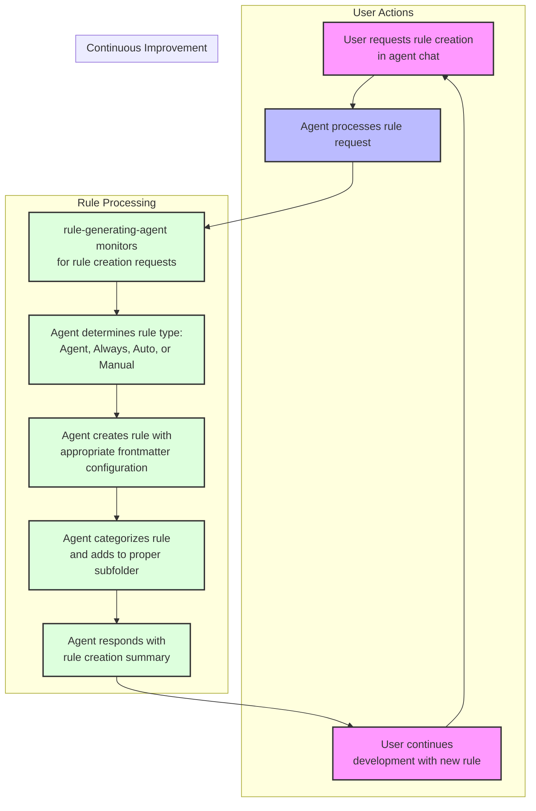

# BMad's Auto Rule Generating Rule (Custom Agents moving to BMAD-Method)

# BMad的自动规则生成规则（自定义代理迁移到BMAD-Method）

April 25, 2025

This repo will remain for the rule generating rule - but content related to the custom agent and workflow are going to be merged with https://github.com/bmadcode/BMAD-METHOD - what I have there is a bit more agnostic to the specific tool (Cursor vs Roo vs Cline vs CoPilot) and the agents are a bit better defined and useful than what is proposed here! I will update the repo on May 1st to reflect this change, and recommend going forward following the BMAD-METRHOD repo instead.

此仓库将保留用于规则生成规则 - 但与自定义代理和工作流相关的内容将合并到 https://github.com/bmadcode/BMAD-METHOD - 我在那里的内容对特定工具（Cursor vs Roo vs Cline vs CoPilot）更加通用，而且代理的定义和实用性比这里提出的更好！我将在5月1日更新仓库以反映这一变化，并建议今后关注BMAD-METHOD仓库。

April 19, 2025

The updates to cursor with 0.49 have made big improvements to rules finally! Some much needed bug fixes.

Cursor 0.49版本的更新终于对规则进行了重大改进！修复了一些急需的bug。

New [video](https://youtu.be/1wQUio9TiIQ?si=3KT5NiO5mDL8GR5P) and [repo](https://github.com/bmadcode/BMAD-METHOD) is up showing how to use the custom agents in conjunction with rules. This is more cursor agnostic if you want to try using other tools in conjunction with Cursor.

新的[视频](https://youtu.be/1wQUio9TiIQ?si=3KT5NiO5mDL8GR5P)和[仓库](https://github.com/bmadcode/BMAD-METHOD)已经上线，展示了如何将自定义代理与规则结合使用。如果您想尝试将其他工具与Cursor结合使用，这个方案更加通用。

April 16, 2025

You can now generate rules directly in a conversation using the `/Generate Cursor Rules` command. This makes it easy to define how the agent should behave without leaving the chat.

现在您可以使用`/Generate Cursor Rules`命令直接在对话中生成规则。这使得定义代理行为变得更容易，无需离开聊天界面。

BMad Version: 3.1 (March 30, 2025)
Cursor Version: 0.48+

BMad版本：3.1（2025年3月30日）
Cursor版本：0.48+

Note from BMad: This repo has become much more successful than I originally envisioned, and I want to thank everyone for the feedback, support, contributions, and also feedback on the youtube channel. I now realize that many are using what I originally thought would be just a way to document some best practices around cursor rules and a simple rule that helps generate the rules - all with the intent of creating a separate updated workflow repo and set of documentation. But this has evolved.

BMad的说明：这个仓库比我最初设想的要成功得多，我要感谢大家提供的反馈、支持、贡献，以及在YouTube频道上的反馈。我现在意识到，许多人正在使用我最初认为只是用来记录一些Cursor规则最佳实践和帮助生成规则的简单规则的东西 - 所有这些都旨在创建一个单独的更新工作流仓库和文档集。但这已经发展演变。

With that in mind, going forward after this correction update - any major changes will follow a versioning standard, and upgrade paths or instructions to migrate if you are already using a prior version of rules or workflows whenever there is a significant potentially breaking change - although I will try to avoid that somehow depending on what comes with Cursor updates or workflow improvements. Keep in mind most changes are to keep up to date with the constantly evolving Cursor IDE and feature release - so there will be continuos changes. Also with that in mind, know that the long game end goal is to build and work in ways that will be less prone to needing to change or flaky as cursor makes changes. This is one reason for example that the workflows outlined further on are now evolving to the superior custom agent modes.

考虑到这一点，在这次修正更新之后 - 任何重大更改都将遵循版本标准，如果您已经在使用先前版本的规则或工作流，每当有重大潜在破坏性更改时，都会提供升级路径或迁移说明 - 尽管我会根据Cursor更新或工作流改进的情况尽量避免这种情况。请记住，大多数更改都是为了跟上不断发展的Cursor IDE和功能发布 - 所以会有持续的变化。同样考虑到这一点，要知道长期目标是以不太容易因Cursor的变化而需要更改或不稳定的方式构建和工作。这就是为什么后面概述的工作流现在正在向更高级的自定义代理模式发展的原因之一。

The name of the repo has changed to BMad Cursor Master Workflow Agent and Rules - this is still the ever evolving same project regarding rules best practices, but its evolving and expanding in features and capability as cursor evolves, becoming more and more powerful to meet the needs of the Cursor and AI Development community, as this may eventually expand beyond cursor.

仓库名称已更改为BMad Cursor Master Workflow Agent and Rules - 这仍然是关于规则最佳实践的不断发展的项目，但随着cursor的发展，它的功能和能力也在不断发展和扩展，变得越来越强大，以满足Cursor和AI开发社区的需求，因为这可能最终会扩展到cursor之外。

Please view the [CHANGELOG](./CHANGELOG.md) for important updates and usage announcements.

请查看[更新日志](./CHANGELOG.md)了解重要更新和使用公告。

## Important Updates TL;DR (March 25, 2025)

## 重要更新摘要（2025年3月25日）

> 💡 **IDE Setting HIGHLY Suggested:** For best results with rule generation, update your VS Code settings (open as JSON via top right button) by adding:
>
> 💡 **强烈建议的IDE设置：** 为了获得最佳的规则生成效果，请通过添加以下内容更新您的VS Code设置（通过右上角按钮打开为JSON）：
>
> ```json
> "workbench.editorAssociations": {
>   "*.mdc": "default"
> }
> ```

This prevents UI rendering issues with .mdc files in a custom rules form and ensures proper save functionality, and makes it easier to see what the actual rules look like (specifically around hidden FrontMatter).

这可以防止.mdc文件在自定义规则表单中的UI渲染问题，确保正确的保存功能，并使查看实际规则的样子变得更容易（特别是关于隐藏的FrontMatter）。

## Overview

## 概述

If you would like to see a [Video Demo and Walkthrough](https://youtu.be/jEhvwYkI-og) start here, please also subscribe for more Cursor tutorials all coming real soon!

如果您想观看[视频演示和教程](https://youtu.be/jEhvwYkI-og)，请从这里开始，也请订阅更多即将推出的Cursor教程！

This template dramatically improves AI workflows in Agent and Custom mode by providing:

这个模板通过提供以下功能显著改进了Agent和Custom模式下的AI工作流：

1. **Automated Rule Generation:** Create and update rules through natural language requests for all 4 main supported rule types correctly following the required Cursor conventions

1. **自动规则生成：** 通过自然语言请求为所有4种主要支持的规则类型创建和更新规则，正确遵循所需的Cursor约定

2. **Automated Custom Agent Generation:** Create and update new custom agents by describing it to the AI, who will then add or update entires in .cursor/modes.json

2. **自动自定义代理生成：** 通过向AI描述来创建和更新新的自定义代理，AI将在.cursor/modes.json中添加或更新条目

3. **Consistent AI Behavior:** Rules are applied automatically when appropriate or on demand or always depending on which of the 4 rule types are created/exist

3. **一致的AI行为：** 根据创建/存在的4种规则类型，规则会在适当的时候自动应用，或按需应用，或始终应用

4. **Quick Project Setup:** A script that will set up a new project with core rules and workflow, or add the rule generator to an existing project in a non destructive manner to existing cursor rules.

4. **快速项目设置：** 一个脚本，可以用核心规则和工作流设置新项目，或以非破坏性的方式将规则生成器添加到现有项目中，不影响现有的cursor规则。

5. **Custom Agent Workflow Instructions:** A new guide is COMING SOON along with a new video on how to follow the massively scalable and successful Agent Agile workflow with multiple specialized Custom Agents, that are much safer and more reliable than any full blown single agent being driven by a massive workflow and extensive rules (the previous way of working)

5. **自定义代理工作流说明：** 新的指南即将推出，同时还有新视频，介绍如何使用多个专业自定义代理遵循大规模可扩展和成功的Agent Agile工作流，这比由大规模工作流和广泛规则驱动的任何完整单一代理（以前的工作方式）更安全、更可靠

6. **Custom Agent Samples:** This repo contains both a vanilla set of sample custom agents in a defined modes.json file that will get copied over when running the apply-rules script, and also has some more fun character personality based options in the samples folder, which exists for illustration (although can be used just as successfully and with more fun when working with the agent) - these will not copy to the new project folder automatically.

6. **自定义代理示例：** 此仓库包含一个在定义的modes.json文件中的基础示例自定义代理集，运行apply-rules脚本时会复制这些代理，同时在samples文件夹中还有一些更有趣的基于角色个性的选项，这些选项用于说明（虽然在与代理一起工作时也可以同样成功和有趣地使用）- 这些不会自动复制到新项目文件夹。

> 💡 **Note:** For a complete guide to the Agile-Cursor Workflow system without using custom agents (no longer recommended), see [Agile Workflow Documentation](docs/agile-readme.md).

> 💡 **注意：** 有关不使用自定义代理的Agile-Cursor工作流系统的完整指南（不再推荐），请参阅[敏捷工作流文档](docs/agile-readme.md)。

## Key Concepts Regarding Cursor Rules

## 关于Cursor规则的关键概念

- Rules use frontmatter with proper YAML format (description, globs, alwaysApply)

- 规则使用具有适当YAML格式的frontmatter（description、globs、alwaysApply）

- Rules will be generated with explicitly requesting a rule be create, or implied by asking for corrective behavior from the agent

- 规则将通过明确请求创建规则或通过要求代理进行纠正行为来生成

- Rules are enhanced by including both a valid and invalid example to better train the llm

- 通过包含有效和无效示例来增强规则，以更好地训练llm

- Short, focused rules (target: 25 lines, maximum: 50 lines)

- 简短、重点突出的规则（目标：25行，最大：50行）

- Four rule types within an automatically organized subfolder categorization structure

- 在自动组织的子文件夹分类结构中的四种规则类型

- Rules will be generated in the proper location under .cursor/rules/sub-folder - remember though sub folder or not - cursor rules must be in the .cursor/rules or a subfolder, and must have the extension .mdc.

- 规则将在.cursor/rules/子文件夹下的适当位置生成 - 但请记住，无论是否有子文件夹 - cursor规则必须在.cursor/rules或其子文件夹中，并且必须具有.mdc扩展名。

## Quick Start Options

## 快速入门选项

### A) npm cli

### A) npm命令行工具

#### 🛠 Requirements

#### 🛠 要求

- Node.js >= 22.14.0

#### 📥 Installation & Usage

#### 📥 安装和使用

```bash
npx cursor-rules-deploy /path/to/your/project
```

For more usage examples, refer to [cursor-rules-deploy](https://github.com/rosendolu/cursor-rules-deploy#readme)

更多使用示例，请参考[cursor-rules-deploy](https://github.com/rosendolu/cursor-rules-deploy#readme)

### B) New Project Setup

### B) 新项目设置

Start a new project with the Agile Workflow and Rules Generator:

使用敏捷工作流和规则生成器启动新项目：

```bash
# Clone this repository
git clone https://github.com/bmadcode/cursor-auto-rules-agile-workflow.git
cd cursor-auto-rules-agile-workflow

# Create new project with rules
./apply-rules.sh /path/to/your/project

# Example:
./apply-rules.sh ~/projects/my-project
```

The script creates your project folder (if needed) with all rules, documentation, and configuration files to start with the agile workflow.

该脚本创建您的项目文件夹（如果需要），包含所有规则、文档和配置文件，以启动敏捷工作流。

### C) Add to Existing Project

### C) 添加到现有项目

Enhance your current project with the rules generator:

使用规则生成器增强您当前的项目：

```bash
# Clone this repository
git clone https://github.com/bmadcode/cursor-auto-rules-agile-workflow.git
cd cursor-auto-rules-agile-workflow

# Apply rules to your project
./apply-rules.sh /path/to/your/project
```

The script will:

该脚本将：

1. Copy template rules to your project's `.cursor/rules/` directory

1. 将模板规则复制到您项目的`.cursor/rules/`目录

2. Add workflow documentation

2. 添加工作流文档

3. Preserve any existing rules

3. 保留任何现有规则

## How Rule Generation Works

## 规则生成的工作原理



## Example Rule Generation Prompts

## 规则生成提示示例

No need to explicitly say "create a rule" - just describe the desired behavior:

无需明确说"创建规则" - 只需描述所需的行为：

- "Create a typescript file commenting standard that balances thoroughness with brevity"

- "创建一个平衡完整性和简洁性的typescript文件注释标准"

- "Please create an agent rule so that whenever I request deep research specifically on a topic you will first always inject the system date time into the context and use the Tavily search MCP tool to improve the results."

- "请创建一个代理规则，以便每当我特别请求对某个主题进行深入研究时，你都会首先将系统日期时间注入到上下文中，并使用Tavily搜索MCP工具来改进结果。"

- "Never create JS files again, you will only create TS or JSON files!" or "I asked you to set up Jest for our project and you created a JestConfig.js file, yet this is a TypeScript only project. Never again create any JS files. Always use TypeScript or JSON if necessary." - the second version of this request will ensure that the rule examples includes this specific call out, helping the agent learn better from actual mistakes made.

- "永远不要再创建JS文件，你只能创建TS或JSON文件！"或"我让你为我们的项目设置Jest，你却创建了一个JestConfig.js文件，但这是一个仅TypeScript的项目。永远不要再创建任何JS文件。必要时始终使用TypeScript或JSON。" - 这个请求的第二个版本将确保规则示例包含这个具体的提醒，帮助代理从实际错误中更好地学习。

- "Ensure proper error handling in all TypeScript files"

- "确保所有TypeScript文件中的错误处理正确"

- "Talk like a pirate in communications but not in code or documentation"

- "在通信中像海盗一样说话，但在代码或文档中不要这样做"

- "Update testing standards to require 80% coverage"

- "更新测试标准，要求80%的覆盖率"

- "Enforce consistent naming conventions in my code"

- "在我的代码中强制执行一致的命名约定"

- "Standardize documentation formats"

- "标准化文档格式"

- "Keep imports organized in groups alphabetically in TypeScript files"

- "在TypeScript文件中按字母顺序将导入组织成组"

The AI automatically:

AI自动：

1. Creates/updates the rule file

1. 创建/更新规则文件

2. Places it in the correct location

2. 将其放在正确的位置

3. Follows formatting standards

3. 遵循格式标准

4. Maintains version control

4. 维护版本控制

## Rule Types

## 规则类型

| Rule Type        | Usage                                            | description Field | globs Field           | alwaysApply field |
| ---------------- | ------------------------------------------------ | ----------------- | --------------------- | ----------------- |
| Agent Selected   | Agent sees description and chooses when to apply | critical          | blank                 | false             |
| Always           | Applied to every chat and cmd-k request          | blank             | blank                 | true              |
| Auto Select      | Applied to matching existing files               | blank             | critical glob pattern | false             |
| Auto Select+desc | Better for new files                             | included          | critical glob pattern | false             |
| Manual           | User must reference in chat                      | blank             | blank                 | false             |

| 规则类型         | 用途                                             | description字段   | globs字段             | alwaysApply字段   |
| ---------------- | ------------------------------------------------ | ----------------- | --------------------- | ----------------- |
| 代理选择         | 代理看到描述并选择何时应用                       | 关键              | 空白                  | false             |
| 始终             | 应用于每个聊天和cmd-k请求                        | 空白              | 空白                  | true              |
| 自动选择         | 应用于匹配的现有文件                             | 空白              | 关键glob模式          | false             |
| 自动选择+描述    | 更适合新文件                                     | 包含              | 关键glob模式          | false             |
| 手动             | 用户必须在聊天中引用                             | 空白              | 空白                  | false             |

## Private Rules, MCP Config and Custom Agents.

## 私有规则、MCP配置和自定义代理。

If you want to have rules that are not used by others in the repository - you can add rules to a .cursor/rules folder in your user folder. They will also be applied to every project you open, which is a potential benefit. Additionally you can use custom agents with their own rules, that are not shared. In the future when Cursor adds the ability to have a agents.json file (or similarly named) - then you should still be able to add it to the user folder .cursor folder. This also works with mcp.json.

如果您想拥有不被仓库中其他人使用的规则 - 您可以将规则添加到用户文件夹中的.cursor/rules文件夹。它们也将应用于您打开的每个项目，这是一个潜在的好处。此外，您可以使用具有自己规则的自定义代理，这些规则不会被共享。将来当Cursor添加agents.json文件（或类似名称）的功能时 - 您仍然应该能够将其添加到用户文件夹的.cursor文件夹中。这也适用于mcp.json。

## Custom Agent Generation

## 自定义代理生成

Custom Agents allow scoping and guidance to what an agent can and cannot do, more directly than using cursor rules files. With a custom agent, you can specify what tools the agent can and cannot use (both cursor native and mcp), and more importantly you can control what model it uses and give it a custom prompt to guide how it operates. This is like a direct injection of a clear always rule for this specific type of agent you have created. When combined with the Agile workflow, you can have a dedicated Project Manager Agent, an Architect Agent, Designer and UX Expert Agents, Front End, Back End, and Language Specific Expert Developers and keep them all focused on what they are good at, and providing them real guardrails.

自定义代理允许比使用cursor规则文件更直接地限定和指导代理可以做什么和不能做什么。使用自定义代理，您可以指定代理可以使用和不能使用的工具（包括cursor原生和mcp），更重要的是，您可以控制它使用的模型并给它一个自定义提示来指导它的操作方式。这就像为您创建的这种特定类型的代理直接注入一个清晰的始终规则。当与敏捷工作流结合使用时，您可以拥有专门的项目经理代理、架构师代理、设计师和UX专家代理、前端、后端和特定语言专家开发人员，并使他们都专注于他们擅长的领域，为他们提供真正的护栏。

Cursor in an upcoming update will allow the creation and maintainability of these in a JSON file - in the meantime, these have to be created manually 1 by one in a gui that is a bit flaky and the text entry are is very small.

Cursor在即将到来的更新中将允许在JSON文件中创建和维护这些内容 - 在此期间，这些内容必须在一个有点不稳定且文本输入区域很小的gui中手动一个一个创建。

So I have come up with a file format to store all the information of my custom agents - which not currently used by cursor, it is an easy way to configure all of their options and define their custom prompts in a text editor - and then input or update via the GUI.

所以我想出了一种文件格式来存储我的自定义代理的所有信息 - 虽然目前不被cursor使用，但它是一种在文本编辑器中配置所有选项和定义自定义提示的简单方法 - 然后通过GUI输入或更新。

You can see in the samples a star-trek-agents.md file - which is a themed fun take on the various roles or agents I might need that I used chatGPT to create and brain storm on. I then use a template and custom rule to transform that file to what becomes modes.json. For the sample, I took that output and saved it instead as star-trek-agents-modes.json in the samples folder. The modes.json file under .cursor is a more practical approach to some agents you can make that will work great with the agile workflow method.

您可以在示例中看到一个star-trek-agents.md文件 - 这是对我可能需要的各种角色或代理的一个主题有趣的尝试，我使用chatGPT来创建和头脑风暴。然后我使用模板和自定义规则将该文件转换为modes.json。对于示例，我将该输出保存为samples文件夹中的star-trek-agents-modes.json。.cursor下的modes.json文件是一种更实用的方法，用于创建一些可以与敏捷工作流方法很好配合的代理。

In the future, that modes.json file will be replaced by the official file format from cursor, at which time this repo will be updated with the new convention.

将来，该modes.json文件将被cursor的官方文件格式取代，届时此仓库将使用新的约定进行更新。

## Best Practices

## 最佳实践

### Rule Creation

### 规则创建

- Let AI handle rule creation and updates - but if you find stuff that is excessive or redundant, dont be afraid to prune the rules to help get them down to their core utility and essence

- 让AI处理规则的创建和更新 - 但如果您发现内容过多或冗余，不要害怕修剪规则以帮助它们回归到核心实用性和本质

- Be specific about desired behaviors

- 对所需行为要具体

- Provide examples of good/bad patterns

- 提供好/坏模式的示例

- For new projects, allow organic rule emergence and try to have overall less rules, and rely more also on custom instructions for your custom agents.

- 对于新项目，允许规则自然出现，尽量保持总体规则较少，更多地依赖自定义代理的自定义指令。

- If you start to have many very small rules applied to the same concept - for example you see your typescript rules subfolder has many files - you can ask the agent to consolidate and condense them down to a single file if they all generally apply and get picked up by the agent at the same time.

- 如果您开始对同一概念应用许多非常小的规则 - 例如您看到您的typescript规则子文件夹有许多文件 - 如果它们通常都适用并且同时被代理获取，您可以要求代理将它们合并和压缩到单个文件中。

### AI Behavior Control

### AI行为控制

- Create rules when noticing inconsistent behavior

- 在注意到不一致的行为时创建规则

- Use clear, descriptive language

- 使用清晰、描述性的语言

- Verify AI understanding by reviewing rules

- 通过审查规则验证AI的理解

### Workflow Integration

### 工作流集成

- Start with template rules

- 从模板规则开始

- Let AI evolve rules as your project grows

- 让AI随着项目的发展而发展规则

- Maintain consistency using AI for rule management

- 使用AI进行规则管理以保持一致性

### Rule Removal

### 规则移除

- Some rules become unnecessary as codebase grows as the AI will follow surrounding code styles and conventions

- 随着代码库的增长，一些规则变得不必要，因为AI会遵循周围的代码风格和约定

- The minimal amount of rules, the better - so prune rules as the codebase changes or models improve

- 规则越少越好 - 所以随着代码库的变化或模型的改进而修剪规则

- A rule you need today, may be a rule you do not need tomorrow, and then again you might need it another day - trial and error and evolution is the key to dealing with the nondeterministic nature of what we are working with here.

- 今天需要的规则，明天可能就不需要了，然后某一天可能又需要它 - 试错和进化是处理我们在这里工作的非确定性本质的关键。

## Files Excluded from Indexing

## 排除在索引之外的文件

The `.cursorindexingignore` feature allows certain files to be accessible but excluded from indexing:

`.cursorindexingignore`功能允许某些文件可访问但排除在索引之外：

- Templates moved to `.cursor/templates` folder

- 模板移动到`.cursor/templates`文件夹

- Included in `.cursorindexingignore` but not in `.cursorignore`

- 包含在`.cursorindexingignore`中但不在`.cursorignore`中

- XNotes remains in `.cursorignore` (files that need to move elsewhere to be used)

- XNotes保留在`.cursorignore`中（需要移动到其他地方才能使用的文件）

> 💡 **Compatibility:** Tested with Claude Sonnet 3.5, 3.7, 3.7 Thinking, o3-mini, and GPT-4o.
> [Agile Workflow Documentation](docs/agile-readme.md)

> 💡 **兼容性：** 已在Claude Sonnet 3.5、3.7、3.7 Thinking、o3-mini和GPT-4o上测试。
> [敏捷工作流文档](docs/agile-readme.md)

## Contributing

## 贡献

Contributions to improve base rules or suggest new templates are welcome. Please follow the established standards.

欢迎贡献以改进基础规则或建议新模板。请遵循既定标准。

## License

## 许可证

MIT 🚀
